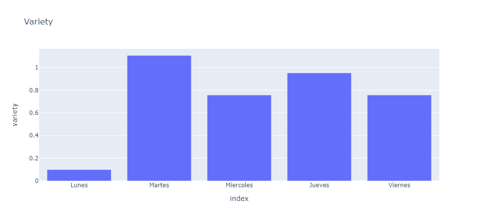

# ***Proyecto: S&P 500 + API yfinance***

El objetivo de este proyecto es brindar un analisis tanto cuantitativo como cualitativo de los movimientos diarios e intradiarios, retorno gap, variacion media, el calculo del VIX, y por medio de un grafico mostrar cuales son las mejores empresas e industrias en el franja de tiempo desde el año 2000 y 2021 inclusive

# KPI

En este apartado se buscar evaluar el compartamiento de como poder invertir teniendo en cuanta los objetivos ya nombrados arriba:  
Retornos de los movimientos GAP 
Retorno movimientos Intradiarios 
Variacion media diaria 
Volatilidad diaria 
Grafico VIX 
Variacion: mejores empresas 
Variacion: mejores sectores

# Extraccion de los simbolos de cada indice y uso de la api yfinance

El proposito de este apartado es la extraccion de los simbolos de las empresas por medio de wikipedia y el uso de la api yfinance guardar todos los datos que correspondan a cada simbolo extraido de wikipedia
Para traer dichos simbolos se uso la libreria pandas para leer dicho link y posteriomente luego guardar los simbolos en una lista. Para la extraccion de datos de la api Yfinance de yahoo se toma como franja de tiempo desde el año 2000 hasta el año 2021 con un intervalo de tiempo de 1 dia

## Analisis de los KPIs    

## Movimientos gap.

El mejor dia para invetir teniendo en cuenta el retorno gap es el dia Martes
  

   

## Movimientos intradiarios.  

 El mejor dia para invitar teniendo en cuantos los movimientos intradiarios es el dia jueves 
 

   

# Variacion media

El dia con mayor variacion media es el dia Martes  

   

# Volatilidad por dia.

El dia con mayor volatilidad es el dia Miercoles 

   

# Grafico VIX entre los años 2020-2021

Como se puede apreciar, la fecha de mas alta volatilidad que afecto al sp500 fue en junio del 2009, que empezo con un alto valor la primera de semana y empezo a descender al final de la semana del mismo mes  

   

# Las mejores empresas S&P500

variacion historica de las mejores empresas del sp500 desde el año 2000 hasta el 2021 inclusive en las que invertir  

   

# Mejores sub-industrias 

mejores sectores del sp500 entre el año 2000 y el año 2021 

   